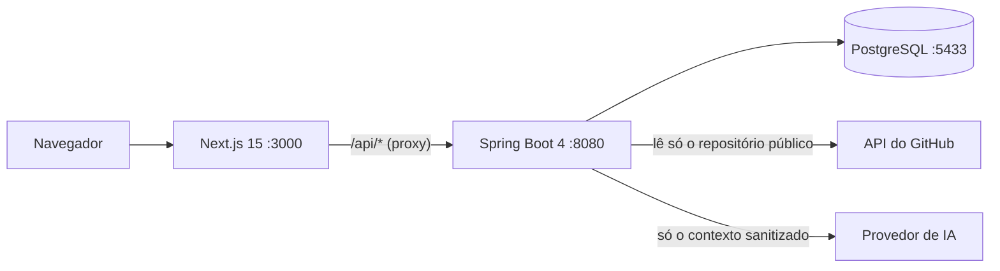

# Koda

Koda transforma o seu repositório do GitHub em desafios reais de desenvolvimento. Você conecta um repositório
público, a Koda lê a estrutura do projeto e uma IA escreve tickets de nível júnior no estilo Jira, baseados no seu
próprio código. A plataforma nunca entrega a solução: as dicas apontam o caminho, e quem resolve é você.

## O que já funciona

- **Login com GitHub** (OAuth), com o token guardado criptografado.
- **Análise do repositório:** stack, camadas, domínios, endpoints, componentes e testes, sem executar nada do projeto.
  Linguagens: **Java** (Spring Boot e Maven), **TypeScript e JavaScript** (NestJS, Express, Fastify, Koa, Hono, Hapi e
  Next.js) e **Python** (FastAPI, Flask e Django). Cada projeto mostra um selo com a linguagem.
- **Desafios com IA:** o código escolhe o ângulo e o alvo (36 ângulos, sem repetir), a IA só redige, e cada ticket
  passa por um verificador, um detector de similaridade e um validador (sem solução, sem classe inventada, critérios
  verificáveis).
- **Andamento do ticket:** começar, concluir e reabrir. A conclusão é declarada por você; a Koda não lê o seu código.
- **Dicas em 3 níveis**, geradas na hora, com validação contra vazamento de solução.
- **Progresso, histórico filtrável e notificações.**
- **Três temas:** preto (padrão), roxo escuro e claro.

## Como funciona



A IA nunca lê o repositório: ela só recebe um contexto resumido e sanitizado (nomes de classes, endpoints e
contagens), e tudo o que ela devolve é tratado como não confiável.

## Como rodar

Você precisa de **JDK 21 ou mais novo**, **Docker** e **Node 22**.

1. **Banco de dados**

   ```bash
   docker compose up -d
   ```

2. **Configuração.** Crie um OAuth App em <https://github.com/settings/developers> com o callback
   `http://localhost:8080/login/oauth2/code/github`, copie `.env.example` para `.env` e preencha (sem aspas). Veja a
   tabela de variáveis abaixo.

3. **Backend**

   ```bash
   ./mvnw spring-boot:run
   ```

4. **Front**

   ```bash
   cd frontend
   npm install
   npm run dev
   ```

Abra <http://localhost:3000>. Com `KODA_IA_PROVEDOR=falso` os tickets e as dicas são simulados, sem rede e sem custo.

### IA de verdade (opcional)

Qualquer endpoint compatível com a API da OpenAI funciona. O caminho gratuito é o
[FreeLLMAPI](https://github.com/tashfeenahmed/freellmapi) rodando só na sua máquina: instale por `git clone` e Docker
Compose, **fora** desta pasta, mantenha a porta em `127.0.0.1` e configure:

```
KODA_IA_PROVEDOR=openai
KODA_IA_URL=http://127.0.0.1:3001/v1
KODA_IA_CHAVE=<a chave do painel dele>
KODA_IA_MODELO=auto
```

### Variáveis de ambiente

| Variável | Para quê | Padrão |
|---|---|---|
| `GITHUB_CLIENT_ID`, `GITHUB_CLIENT_SECRET` | Login com GitHub | obrigatória |
| `TOKEN_ENCRYPTION_KEY` | Chave AES-256 em Base64 (`openssl rand -base64 32`) | obrigatória |
| `KODA_IA_PROVEDOR` | `falso` ou `openai` | `falso` |
| `KODA_IA_URL`, `KODA_IA_CHAVE`, `KODA_IA_MODELO` | Provedor de IA compatível com OpenAI | vazio |
| `KODA_DESAFIO_LIMITE_DIARIO` | Tickets por pessoa em 24 horas | `5` |
| `KODA_DICA_LIMITE_DIARIO` | Dicas por pessoa em 24 horas | `10` |
| `KODA_SERVIDOR_ENDERECO` | Endereço em que o backend escuta | `127.0.0.1` |
| `KODA_COOKIE_SEGURO` | Cookie de sessão só por HTTPS | `false` |

O backend recusa subir se algum valor sensível vier entre aspas e diz qual (o Spring não remove aspas do `.env`).

## Testes e qualidade

| O quê | Comando |
|---|---|
| Backend: testes, cobertura com piso e build | `./mvnw verify` |
| Front: tipos, lint, testes e build | `cd frontend && npm run typecheck && npm run lint && npm test && npm run build` |
| Teste de mutação (validador, seletor e similaridade) | `./mvnw -Pmutacao test-compile org.pitest:pitest-maven:mutationCoverage` |
| Medição da IA de verdade (gasta cota do provedor) | `set -a; . ./.env; set +a; ./mvnw -Pmedicao test -Dtest=MedicaoComIaRealTest` |

Os testes do backend rodam num banco próprio, o `koda_test`, que eles mesmos criam no Postgres do Compose; nunca tocam no
banco de desenvolvimento. O CI (GitHub Actions) roda tudo isso a cada push e pull request.

## Estrutura

```
src/main/java/com/koda/v1/
  auth/        login, sessão, CSRF e cabeçalhos de segurança
  user/        usuários
  github/      cliente da API do GitHub e token criptografado
  analyzer/    leitura do repositório e contexto do projeto; um ecossistema por linguagem em `ecossistema/`
  challenge/   catálogo de ângulos, seleção, IA, validação, dicas, histórico e notificações
  shared/      criptografia e verificação de configuração
frontend/      Next.js 15, React 19 e Tailwind 4
docker-compose.yml, .github/   banco local e CI
```

## Segurança

Só a máquina local alcança o backend e o banco; sem sessão a API devolve 401; tudo que vem da IA é validado e nunca
entra em log; prompts e chaves nunca são registrados. Os detalhes e as decisões estão no [CLAUDE.md](CLAUDE.md).

## Créditos

Os logos das tecnologias em `frontend/public/tecnologias` vêm do [Devicon](https://github.com/devicons/devicon) (licença MIT). Cada logo pertence à respectiva marca.
